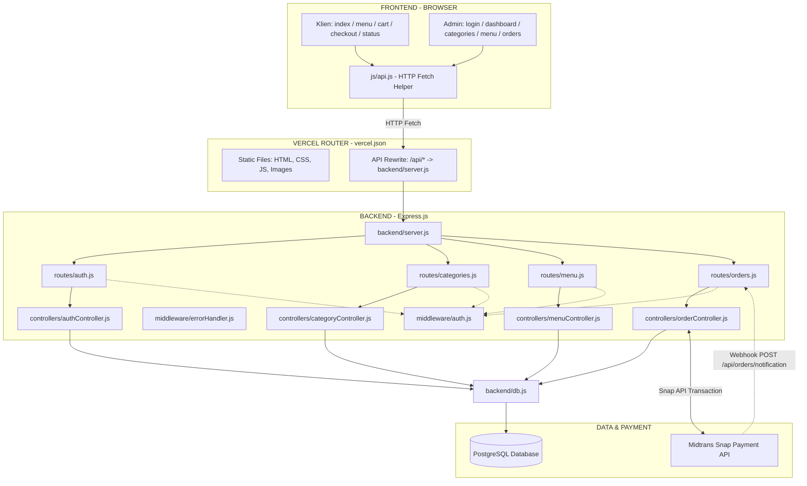

# 📦 IMPLEMENTATION.md — Dokumentasi Lengkap & Panduan Arsitektur Sistem QR Ordering

Dokumen ini adalah **panduan teknis terlengkap** yang menjelaskan arsitektur, struktur file, alur data, serta **seluruh skenario/kasus nyata** (sisi Pelanggan, Admin, Kasir, dan Sistem/Server) pada aplikasi pemesanan QR Code **Uncle Jo**.

setiap kasus dilengkapi dengan:
- 📌 **Lokasi File yang Terlibat** (Frontend UI, Frontend JS, Backend Route, Middleware, Controller, & Database)
- 🔄 **Alur Kerja Langkah demi Langkah**
- 💻 **Potongan Kode Sumber (Code Snippet)**
- 🗄️ **Query SQL / Perubahan Data yang Terjadi**

---

## 📑 Daftar Isi
1. [Arsitektur & Diagram Sistem Global](#1-arsitektur--diagram-sistem-global)
2. [Skenario Kasus Pelanggan (Customer Flow)](#2-skenario-kasus-pelanggan-customer-flow)
   - [Kasus 1: Pindaian QR Code / Masuk Beranda & Pemilihan Meja](#kasus-1-pindaian-qr-code--masuk-beranda--pemilihan-meja)
   - [Kasus 2: Membuka Katalog Menu, Filter Kategori & Pencarian Produk](#kasus-2-membuka-katalog-menu-filter-kategori--pencarian-produk)
   - [Kasus 3: Memilih Varian (Hot / Ice) & Menambahkan ke Keranjang Lokal](#kasus-3-memilih-varian-hot--ice--menambahkan-ke-keranjang-lokal)
   - [Kasus 4: Mengelola Keranjang Belanja (Ubah Qty, Hapus Item, Subtotal)](#kasus-4-mengelola-keranjang-belanja-ubah-qty-hapus-item-subtotal)
   - [Kasus 5: Proses Checkout & Pemilihan Metode Pembayaran](#kasus-5-proses-checkout--pemilihan-metode-pembayaran)
   - [Kasus 6: Eksekusi Pembayaran Digital Midtrans Snap](#kasus-6-eksekusi-pembayaran-digital-midtrans-snap)
   - [Kasus 7: Pelacakan Status Pesanan Real-Time (HTTP Polling) & Tombol Bayar Ulang](#kasus-7-pelacakan-status-pesanan-real-time-http-polling--tombol-bayar-ulang)
3. [Skenario Kasus Administrator & Kasir (Admin Flow)](#3-skenario-kasus-administrator--kasir-admin-flow)
   - [Kasus 8: Login Administrator & Pembuatan Token JWT](#kasus-8-login-administrator--pembuatan-token-jwt)
   - [Kasus 9: Otorisasi Sesi JWT, Token Kedaluwarsa & Auto-Logout](#kasus-9-otorisasi-sesi-jwt-token-kedaluwarsa--auto-logout)
   - [Kasus 10: Memantau Ringkasan Dashboard Statistik Toko](#kasus-10-memantau-ringkasan-dashboard-statistik-toko)
   - [Kasus 11: Pengelolaan Antrean Pesanan Kasir/Dapur (FIFO & Update Status Linier)](#kasus-11-pengelolaan-antrean-pesanan-kasirdapur-fifo--update-status-linier)
   - [Kasus 12: Pelunasan Pesanan Tunai Manual oleh Kasir](#kasus-12-pelunasan-pesanan-tunai-manual-oleh-kasir)
   - [Kasus 13: Kelola Kategori Produk (CRUD Categories & Cek Duplikasi)](#kasus-13-kelola-kategori-produk-crud-categories--cek-duplikasi)
   - [Kasus 14: Kelola Produk Menu Restoran (CRUD Menu & Upload Base64 Image)](#kasus-14-kelola-produk-menu-restoran-crud-menu--upload-base64-image)
   - [Kasus 15: Hapus Seluruh Pesanan Hari Ini](#kasus-15-hapus-seluruh-pesanan-hari-ini)
4. [Skenario Kasus Sistem & Background (System & Webhook Flow)](#4-skenario-kasus-sistem--background-system--webhook-flow)
   - [Kasus 16: Webhook Server-to-Server Callback dari Midtrans (IPN Notification)](#kasus-16-webhook-server-to-server-callback-dari-midtrans-ipn-notification)
   - [Kasus 17: Centralized Error Handling (`asyncHandler` & `errorHandler.js`)](#kasus-17-centralized-error-handling-asynchandler--errorhandlerjs)
   - [Kasus 18: Script Utilitas Terminal (`backend/clear.js` & `hash.js`)](#kasus-18-script-utilitas-terminal-backendclearjs--hashjs)
5. [Tabel Lengkap Peta Seluruh File Proyek](#5-tabel-lengkap-peta-seluruh-file-proyek)

---

## 1. Arsitektur & Diagram Sistem Global

Aplikasi ini berbasis **Full-Stack Decoupled Architecture** yang dideploy di Vercel:



---

## 2. Skenario Kasus Pelanggan (Customer Flow)

---

### Kasus 1: Pindaian QR Code / Masuk Beranda & Pemilihan Meja

> **Skenario:** Pelanggan (Budi) datang ke restoran, duduk di **Meja 3**, lalu memindai QR code di meja.

#### 📌 Lokasi File Terlibat:
*   Frontend UI: `frontend/index.html`
*   Frontend Script: `frontend/js/index.js`
*   Browser Storage: `localStorage`

#### 🔄 Alur & Potongan Kode:

1. **Deteksi Parameter URL (`frontend/js/index.js`):**
   Saat Budi mendatangi URL `https://domain.com/?meja=3`, skrip membaca `URLSearchParams`:
   ```javascript
   // frontend/js/index.js
   const urlParams = new URLSearchParams(window.location.search);
   const paramMeja = urlParams.get('meja'); // Hasil: "3"

   if (paramMeja && parseInt(paramMeja, 10) > 0) {
     localStorage.setItem('nomor_meja', paramMeja);
     window.location.href = `menu.html?meja=${paramMeja}`;
   }
   ```
2. **Pilihan Manual (jika tanpa scan QR):**
   Jika Budi memilih tombol "Meja 3" pada halaman `index.html`:
   ```javascript
   // frontend/js/index.js
   function selectMeja(nomor) {
     localStorage.setItem('nomor_meja', nomor);
     window.location.href = `menu.html?meja=${nomor}`;
   }
   ```

**Hasil Akhir:** Browser menyimpan `nomor_meja = "3"` di `localStorage` dan berpindah ke `menu.html`.

---

### Kasus 2: Membuka Katalog Menu, Filter Kategori & Pencarian Produk

> **Skenario:** Budi membuka katalog menu, memfilter kategori "Minuman", dan mencari "Kopi".

#### 📌 Lokasi File Terlibat:
*   Frontend UI: `frontend/menu.html`
*   Frontend Script: `frontend/js/menu.js`
*   API Helper: `frontend/js/api.js`
*   Backend Route: `backend/routes/menu.js` & `backend/routes/categories.js`
*   Backend Controller: `backend/controllers/menuController.js` & `backend/controllers/categoryController.js`
*   Database Table: `menu` & `categories`

#### 🔄 Alur & Potongan Kode:

1. **Pengambilan Data dari API (`frontend/js/menu.js`):**
   ```javascript
   // frontend/js/menu.js
   async function initMenuPage() {
     listCategories = await API.get('/api/categories');
     listMenu = await API.get('/api/menu');
     renderKategoriBar();
     renderMenuGrid();
   }
   ```

2. **Pemrosesan di Backend (`backend/controllers/menuController.js`):**
   ```javascript
   // backend/controllers/menuController.js
   async function getAllMenu(req, res) {
     const result = await db.query('SELECT * FROM menu ORDER BY id DESC');
     const menus = result.rows.map(item => ({
       ...item,
       harga: calculateBasePrice(item.is_hot_ice, item.harga, item.harga_hot, item.harga_ice)
     }));
     res.json(menus);
   }
   ```

3. **Query SQL di Database:**
   ```sql
   SELECT * FROM categories ORDER BY nama;
   SELECT * FROM menu ORDER BY id DESC;
   ```

4. **Filter Kategori & Pencarian Real-Time (`frontend/js/menu.js`):**
   ```javascript
   // frontend/js/menu.js
   function getFilteredMenu() {
     return listMenu.filter(item => {
       const cocokKategori = (kategoriAktif === 'Semua') || (item.kategori === kategoriAktif);
       const cocokCari = item.nama.toLowerCase().includes(searchQuery.toLowerCase());
       return cocokKategori && cocokCari;
     });
   }
   ```

---

### Kasus 3: Memilih Varian (Hot / Ice) & Menambahkan ke Keranjang Lokal

> **Skenario:** Budi memilih produk "Kopi Susu", memilih varian **Ice (Rp 18.000)**, lalu menekan tombol "Tambah ke Keranjang".

#### 📌 Lokasi File Terlibat:
*   Frontend Script: `frontend/js/menu.js`
*   Browser Storage: `localStorage('cart')`

#### 🔄 Alur & Potongan Kode:

1. **Membuka Modal Detail Produk (`frontend/js/menu.js`):**
   ```javascript
   // frontend/js/menu.js
   function openModal(menuId) {
     const item = listMenu.find(m => m.id === menuId);
     selectedVarian = item.is_hot_ice ? 'Hot' : null; // Varian default
     renderModalContent(item);
   }
   ```

2. **Menyimpan ke LocalStorage (`frontend/js/menu.js`):**
   ```javascript
   // frontend/js/menu.js
   function addToCartFromModal() {
     let cart = JSON.parse(localStorage.getItem('cart')) || [];
     const hargaFinal = (selectedVarian === 'Ice') ? selectedItem.harga_ice : selectedItem.harga_hot;

     cart.push({
       id: selectedItem.id,
       nama: selectedItem.nama,
       harga: hargaFinal,
       qty: currentQty,
       varian: selectedVarian,
       gambar: selectedItem.gambar
     });

     localStorage.setItem('cart', JSON.stringify(cart));
     updateCartBadge();
   }
   ```

---

### Kasus 4: Mengelola Keranjang Belanja (Ubah Qty, Hapus Item, Subtotal)

> **Skenario:** Budi melihat keranjang belanja di `cart.html`, menambah kuantitas Roti Bakar dari 1 jadi 2, dan menghapus pesanan Snack.

#### 📌 Lokasi File Terlibat:
*   Frontend UI: `frontend/cart.html`
*   Frontend Script: `frontend/js/cart.js`

#### 🔄 Alur & Potongan Kode:

1. **Render & Hitung Subtotal (`frontend/js/cart.js`):**
   ```javascript
   // frontend/js/cart.js
   function renderCart() {
     let total = 0;
     container.innerHTML = cart.map((item, idx) => {
       const subtotal = item.harga * item.qty;
       total += subtotal;
       return `<!-- HTML baris item -->`;
     }).join('');

     document.getElementById('totalVal').textContent = formatRupiah(total);
   }
   ```

2. **Update Kuantitas & Hapus Item (`frontend/js/cart.js`):**
   ```javascript
   // frontend/js/cart.js
   function updateQty(idx, change) {
     cart[idx].qty += change;
     if (cart[idx].qty <= 0) cart.splice(idx, 1);
     localStorage.setItem('cart', JSON.stringify(cart));
     renderCart();
   }

   function removeItem(idx) {
     cart.splice(idx, 1);
     localStorage.setItem('cart', JSON.stringify(cart));
     renderCart();
   }
   ```

---

### Kasus 5: Proses Checkout & Pemilihan Metode Pembayaran

> **Skenario:** Budi masuk ke `checkout.html`, mengisi nama "Budi", memilih meja "3", memilih metode "Nontunai", lalu klik "Pesan Sekarang".

#### 📌 Lokasi File Terlibat:
*   Frontend UI: `frontend/checkout.html`
*   Frontend Script: `frontend/js/checkout.js`
*   Backend Route: `backend/routes/orders.js`
*   Backend Controller: `backend/controllers/orderController.js` (`createOrder`)
*   Database Tables: `orders` & `order_items`

#### 🔄 Alur & Potongan Kode:

1. **Mengirim Payload Pesanan (`frontend/js/checkout.js`):**
   ```javascript
   // frontend/js/checkout.js
   async function prosesCheckout() {
     const payload = {
       nomor_meja: "3",
       nama_pelanggan: "Budi",
       items: cart.map(c => ({ menu_id: c.id, qty: c.qty, varian: c.varian })),
       metode_pembayaran: "nontunai" // atau 'tunai'
     };

     const data = await API.post('/api/orders', payload);
     localStorage.removeItem('cart'); // Kosongkan keranjang setelah sukses
   }
   ```

2. **Transaksi Database ACID di Backend (`backend/controllers/orderController.js`):**
   ```javascript
   // backend/controllers/orderController.js
   async function createOrder(req, res) {
     const client = await db.pool.connect();
     try {
       await client.query('BEGIN'); // Start DB Transaction

       // 1. Insert ke tabel orders
       const orderRes = await client.query(
         `INSERT INTO orders (nomor_meja, status, metode_pembayaran, status_pembayaran, nama_pelanggan)
          VALUES ($1, 'Menunggu', $2, 'Belum Bayar', $3) RETURNING *`,
         [nomor_meja, paymentMethod, nama_pelanggan]
       );
       const orderId = orderRes.rows[0].id;

       // 2. Insert item pesanan ke tabel order_items
       for (const item of items) {
         const menuRes = await client.query('SELECT * FROM menu WHERE id = $1', [item.menu_id]);
         // Kalkulasi subtotal berdasarkan varian...
         await client.query(
           `INSERT INTO order_items (order_id, menu_id, qty, subtotal, varian) VALUES ($1, $2, $3, $4, $5)`,
           [orderId, item.menu_id, item.qty, subtotal, item.varian]
         );
       }

       await client.query('COMMIT'); // Commit DB Transaction
     } catch (error) {
       await client.query('ROLLBACK'); // Rollback jika ada error
       throw error;
     } finally {
       client.release();
     }
   }
   ```

---

### Kasus 6: Eksekusi Pembayaran Digital Midtrans Snap

> **Skenario:** Untuk metode Nontunai, backend mendaftarkan transaksi ke Midtrans API dan mengembalikan `snap_token` agar popup pembayaran muncul di browser Budi.

#### 📌 Lokasi File Terlibat:
*   Backend Controller: `backend/controllers/orderController.js` (`createOrder`)
*   Frontend Script: `frontend/js/checkout.js`
*   External API: Midtrans Snap SDK (`snap.pay`)

#### 🔄 Alur & Potongan Kode:

1. **Registrasi Snap Client di Backend (`backend/controllers/orderController.js`):**
   ```javascript
   // backend/controllers/orderController.js
   if (paymentMethod === 'nontunai') {
     const midtransParams = {
       transaction_details: {
         order_id: `ORDER-${orderId}-${Date.now()}`,
         gross_amount: Number(totalHarga)
       },
       item_details: itemDetails,
       customer_details: { first_name: nama_pelanggan }
     };

     const transaction = await snapClient.createTransaction(midtransParams);
     await db.query('UPDATE orders SET midtrans_token = $1 WHERE id = $2', [transaction.token, orderId]);

     return res.status(201).json({ order_id: orderId, snap_token: transaction.token });
   }
   ```

2. **Trigger Popup Snap di Frontend (`frontend/js/checkout.js`):**
   ```javascript
   // frontend/js/checkout.js
   if (data.snap_token) {
     snap.pay(data.snap_token, {
       onSuccess: function(result) {
         API.post(`/api/orders/${data.order_id}/update-payment-client`, { status_pembayaran: 'Sudah Bayar' })
           .finally(() => { window.location.href = `status.html?id=${data.order_id}`; });
       },
       onPending: function() { window.location.href = `status.html?id=${data.order_id}`; },
       onError: function() { window.location.href = `status.html?id=${data.order_id}`; },
       onClose: function() { window.location.href = `status.html?id=${data.order_id}`; }
     });
   }
   ```

---

### Kasus 7: Pelacakan Status Pesanan Real-Time (HTTP Polling) & Tombol Bayar Ulang

> **Skenario:** Budi berada di `status.html?id=42`. Halaman ini melakukan polling HTTP setiap 10 detik ke backend untuk memperbarui indikator status secara otomatis.

#### 📌 Lokasi File Terlibat:
*   Frontend UI: `frontend/status.html`
*   Frontend Script: `frontend/js/status.js`
*   Backend Route: `backend/routes/orders.js` (`GET /api/orders/:id/status`)
*   Backend Controller: `backend/controllers/orderController.js` (`getOrderStatus`)

#### 🔄 Alur & Potongan Kode:

1. **Mekanisme Polling Timer (`frontend/js/status.js`):**
   ```javascript
   // frontend/js/status.js
   async function dapatkanStatus() {
     const data = await API.get(`/api/orders/${orderId}/status`);
     perbaruiUI(data);
   }

   dapatkanStatus(); // Eksekusi pertama
   const interval = setInterval(dapatkanStatus, 10000); // Polling setiap 10 detik
   ```

2. **Render UI Progress Tracker & Tombol Bayar Ulang (`frontend/js/status.js`):**
   ```javascript
   // frontend/js/status.js
   function perbaruiUI(data) {
     const { order, items } = data;
     const urutanStatus = ['Menunggu', 'Diproses', 'Siap', 'Selesai'];
     const idxAktif = urutanStatus.indexOf(order.status);

     // Perbarui indikator step
     urutanStatus.forEach((s, idx) => {
       const el = document.getElementById(`step-${s}`);
       el.classList.remove('active', 'done');
       if (idx < idxAktif) el.classList.add('done');
       if (idx === idxAktif) el.classList.add('active');
     });

     // Tampilkan tombol Bayar Ulang jika Nontunai belum lunas
     if (order.metode_pembayaran === 'nontunai' && order.status_pembayaran === 'Belum Bayar' && order.midtrans_token) {
       document.getElementById('btnBayarUlangContainer').style.display = 'block';
       document.getElementById('btnBayarUlang').onclick = () => snap.pay(order.midtrans_token, { ... });
     }
   }
   ```

---

## 3. Skenario Kasus Administrator & Kasir (Admin Flow)

---

### Kasus 8: Login Administrator & Pembuatan Token JWT

> **Skenario:** Admin membuka `admin/login.html`, memasukkan username `admin` dan password `admin123`.

#### 📌 Lokasi File Terlibat:
*   Frontend UI: `frontend/admin/login.html`
*   Frontend Script: `frontend/admin/js/login.js`
*   Backend Route: `backend/routes/auth.js` (`POST /api/auth/login`)
*   Backend Controller: `backend/controllers/authController.js` (`login`)

#### 🔄 Alur & Potongan Kode:

1. **Pengiriman Kredensial (`frontend/admin/js/login.js`):**
   ```javascript
   // frontend/admin/js/login.js
   const res = await API.post('/api/auth/login', { username, password });
   API.setToken(res.token); // Simpan token JWT di localStorage
   localStorage.setItem('admin_username', res.user.username);
   window.location.href = '/admin/dashboard.html';
   ```

2. **Verifikasi Hash Bcrypt & Pembuatan Token (`backend/controllers/authController.js`):**
   ```javascript
   // backend/controllers/authController.js
   async function login(req, res) {
     const { username, password } = req.body;
     const userRes = await db.query('SELECT * FROM users WHERE username = $1', [username]);
     if (userRes.rows.length === 0) return res.status(401).json({ pesan: 'Username/password salah' });

     const user = userRes.rows[0];
     const cocok = await bcrypt.compare(password, user.password);
     if (!cocok) return res.status(401).json({ pesan: 'Username/password salah' });

     const token = jwt.sign(
       { id: user.id, username: user.username },
       config.jwtSecret,
       { expiresIn: config.jwtExpiresIn }
     );

     res.json({ pesan: 'Login berhasil', token, user: { id: user.id, username: user.username } });
   }
   ```

---

### Kasus 9: Otorisasi Sesi JWT, Token Kedaluwarsa & Auto-Logout

> **Skenario:** Admin yang tidak memiliki token valid mencoba mengakses rute admin. Server menolak request dengan status `401 Unauthorized`, dan frontend melakukan **Auto-Logout**.

#### 📌 Lokasi File Terlibat:
*   Backend Middleware: `backend/middleware/auth.js` (`verifikasiToken`)
*   Frontend API Helper: `frontend/js/api.js`

#### 🔄 Alur & Potongan Kode:

1. **Middleware Verifikasi Token (`backend/middleware/auth.js`):**
   ```javascript
   // backend/middleware/auth.js
   function verifikasiToken(req, res, next) {
     const authHeader = req.headers['authorization'];
     const token = authHeader && authHeader.split(' ')[1]; // "Bearer <TOKEN>"

     if (!token) return res.status(401).json({ pesan: 'Akses ditolak. Token tidak ditemukan.' });

     try {
       const terverifikasi = jwt.verify(token, config.jwtSecret);
       req.user = terverifikasi;
       next();
     } catch (error) {
       return res.status(403).json({ pesan: 'Token kedaluwarsa atau tidak valid.' });
     }
   }
   ```

2. **Penanganan Error HTTP 401/403 di Frontend (`frontend/js/api.js`):**
   ```javascript
   // frontend/js/api.js
   async request(endpoint, options = {}) {
     const token = this.getToken();
     if (token) headers['Authorization'] = `Bearer ${token}`;

     const response = await fetch(endpoint, config);
     if (response.status === 401 || response.status === 403) {
       this.removeToken();
       window.location.href = '/admin/login.html';
     }
     return response.json();
   }
   ```

---

### Kasus 10: Memantau Ringkasan Dashboard Statistik Toko

> **Skenario:** Admin membuka `admin/dashboard.html` untuk melihat total menu, pesanan hari ini, pesanan pending, dan 5 pesanan terbaru.

#### 📌 Lokasi File Terlibat:
*   Frontend Script: `frontend/admin/js/dashboard.js`
*   Backend Controller: `backend/controllers/orderController.js` (`getDashboardSummary`)

#### 🔄 Alur & Potongan Kode:

1. **Backend Aggregation Query (`backend/controllers/orderController.js`):**
   ```javascript
   // backend/controllers/orderController.js
   async function getDashboardSummary(req, res) {
     const menuCount = await db.query('SELECT COUNT(*) FROM menu');
     const ordersToday = await db.query("SELECT COUNT(*) FROM orders WHERE DATE(tanggal) = CURRENT_DATE");
     const ordersWaiting = await db.query("SELECT COUNT(*) FROM orders WHERE status = 'Menunggu'");
     const recentOrders = await db.query("SELECT * FROM orders ORDER BY tanggal DESC LIMIT 5");

     res.json({
       jumlah_menu: parseInt(menuCount.rows[0].count, 10),
       pesanan_hari_ini: parseInt(ordersToday.rows[0].count, 10),
       pesanan_menunggu: parseInt(ordersWaiting.rows[0].count, 10),
       pesanan_terbaru: recentOrders.rows
     });
   }
   ```

---

### Kasus 11: Pengelolaan Antrean Pesanan Kasir/Dapur (FIFO & Update Status Linier)

> **Skenario:** Bagian dapur melihat pesanan #42 berstatus "Menunggu", lalu mengklik "Mulai Proses" (berubah jadi "Diproses"), kemudian "Tandai Siap" (berubah jadi "Siap").

#### 📌 Lokasi File Terlibat:
*   Frontend UI: `frontend/admin/orders.html`
*   Frontend Script: `frontend/admin/js/orders.js`
*   Backend Route: `backend/routes/orders.js` (`PATCH /api/orders/:id/status`)
*   Backend Controller: `backend/controllers/orderController.js` (`updateOrderStatus`)

#### 🔄 Alur & Potongan Kode:

1. **Pengurutan Antrean FIFO di Frontend (`frontend/admin/js/orders.js`):**
   ```javascript
   // frontend/admin/js/orders.js
   // Urutkan: Menunggu -> Diproses -> Siap -> Selesai
   const urutan = ['Menunggu', 'Diproses', 'Siap', 'Selesai'];
   filtered.sort((a, b) => urutan.indexOf(a.status) - urutan.indexOf(b.status));
   ```

2. **Update Status via API (`frontend/admin/js/orders.js`):**
   ```javascript
   // frontend/admin/js/orders.js
   async function updateStatus(orderId, newStatus) {
     await API.patch(`/api/orders/${orderId}/status`, { status: newStatus });
     loadOrders(); // Reload antrean admin
   }
   ```

3. **Eksekusi Update SQL (`backend/controllers/orderController.js`):**
   ```javascript
   // backend/controllers/orderController.js
   async function updateOrderStatus(req, res) {
     const { id } = req.params;
     const { status } = req.body;
     const updateRes = await db.query(
       'UPDATE orders SET status = $1 WHERE id = $2 RETURNING *',
       [status, id]
     );
     res.json({ pesan: 'Status pesanan berhasil diperbarui.', order: updateRes.rows[0] });
   }
   ```

---

### Kasus 12: Pelunasan Pesanan Tunai Manual oleh Kasir

> **Skenario:** Pelanggan bayar tunai di kasir. Kasir mengklik tombol "✓ Lunas" pada pesanan pelanggan di `admin/orders.html`.

#### 📌 Lokasi File Terlibat:
*   Frontend Script: `frontend/admin/js/orders.js` (`markOrderPaid`)
*   Backend Route: `backend/routes/orders.js` (`POST /api/orders/:id/mark-paid`)
*   Backend Controller: `backend/controllers/orderController.js` (`markOrderAsPaid`)

#### 🔄 Alur & Potongan Kode:

1. **Trigger Pelunasan di Kasir (`frontend/admin/js/orders.js`):**
   ```javascript
   // frontend/admin/js/orders.js
   async function markOrderPaid(orderId) {
     if (!confirm('Tandai pesanan ini sebagai Lunas / Sudah Bayar?')) return;
     await API.post(`/api/orders/${orderId}/mark-paid`);
     loadOrders();
   }
   ```

2. **Update Status Pembayaran di DB (`backend/controllers/orderController.js`):**
   ```javascript
   // backend/controllers/orderController.js
   async function markOrderAsPaid(req, res) {
     const { id } = req.params;
     await db.query("UPDATE orders SET status_pembayaran = 'Sudah Bayar' WHERE id = $1", [id]);
     res.json({ pesan: 'Pesanan berhasil ditandai sebagai Lunas.' });
   }
   ```

---

### Kasus 13: Kelola Kategori Produk (CRUD Categories & Cek Duplikasi)

> **Skenario:** Admin membuka `admin/categories.html` untuk menambah kategori baru "Dessert".

#### 📌 Lokasi File Terlibat:
*   Frontend UI: `frontend/admin/categories.html`
*   Frontend Script: `frontend/admin/js/categories.js`
*   Backend Route: `backend/routes/categories.js`
*   Backend Controller: `backend/controllers/categoryController.js`

#### 🔄 Alur & Potongan Kode:

1. **Tambah / Edit Kategori (`backend/controllers/categoryController.js`):**
   ```javascript
   // backend/controllers/categoryController.js
   async function createCategory(req, res) {
     const { nama } = req.body;
     const existing = await db.query('SELECT * FROM categories WHERE LOWER(nama) = LOWER($1)', [nama]);
     if (existing.rows.length > 0) {
       return res.status(400).json({ pesan: 'Kategori dengan nama tersebut sudah ada.' });
     }
     const newCat = await db.query('INSERT INTO categories (nama) VALUES ($1) RETURNING *', [nama]);
     res.status(201).json(newCat.rows[0]);
   }
   ```

---

### Kasus 14: Kelola Produk Menu Restoran (CRUD Menu & Upload Base64 Image)

> **Skenario:** Admin menambah menu baru "Matcha Latte", mengatur varian Hot/Ice, dan mengunggah foto menu.

#### 📌 Lokasi File Terlibat:
*   Frontend UI: `frontend/admin/menu.html`
*   Frontend Script: `frontend/admin/js/menu.js`
*   Backend Route: `backend/routes/menu.js`
*   Backend Controller: `backend/controllers/menuController.js`

#### 🔄 Alur & Potongan Kode:

1. **Konversi Foto ke Base64 (`frontend/admin/js/menu.js`):**
   ```javascript
   // frontend/admin/js/menu.js
   function convertImageToBase64(file) {
     return new Promise((resolve, reject) => {
       const reader = new FileReader();
       reader.onload = () => resolve(reader.result);
       reader.onerror = error => reject(error);
       reader.readAsDataURL(file);
     });
   }
   ```

2. **Simpan Menu ke PostgreSQL (`backend/controllers/menuController.js`):**
   ```javascript
   // backend/controllers/menuController.js
   async function createMenu(req, res) {
     const { nama, harga, gambar, kategori, is_hot_ice, harga_hot, harga_ice, is_favorit } = req.body;
     const newMenu = await db.query(
       `INSERT INTO menu (nama, harga, gambar, kategori, is_hot_ice, harga_hot, harga_ice, is_favorit)
        VALUES ($1, $2, $3, $4, $5, $6, $7, $8) RETURNING *`,
       [nama, harga, gambar, kategori, is_hot_ice, harga_hot, harga_ice, is_favorit]
     );
     res.status(201).json(newMenu.rows[0]);
   }
   ```

---

### Kasus 15: Hapus Seluruh Pesanan Hari Ini

> **Skenario:** Admin mengklik tombol "Hapus Semua Pesanan" di `admin/orders.html` untuk mengosongkan antrean transaksi.

#### 📌 Lokasi File Terlibat:
*   Frontend Script: `frontend/admin/js/orders.js` (`clearTodayOrders`)
*   Backend Route: `backend/routes/orders.js` (`DELETE /api/orders/today`)
*   Backend Controller: `backend/controllers/orderController.js` (`deleteAllOrders`)

#### 🔄 Alur & Potongan Kode:

```javascript
// backend/controllers/orderController.js
async function deleteAllOrders(req, res) {
  const result = await db.query("DELETE FROM orders");
  res.json({ pesan: `Berhasil menghapus seluruh pesanan (${result.rowCount} pesanan dibersihkan).` });
}
```

---

## 4. Skenario Kasus Sistem & Background (System & Webhook Flow)

---

### Kasus 16: Webhook Server-to-Server Callback dari Midtrans (IPN Notification)

> **Skenario:** Setelah pelanggan menyelesaikan pembayaran online, server Midtrans secara independen mengirimkan callback HTTP POST ke server backend kamu.

#### 📌 Lokasi File Terlibat:
*   External Call: Midtrans Notification Engine
*   Backend Route: `backend/routes/orders.js` (`POST /api/orders/notification`)
*   Backend Controller: `backend/controllers/orderController.js` (`handleMidtransNotification`)

#### 🔄 Alur & Potongan Kode:

```javascript
// backend/controllers/orderController.js
async function handleMidtransNotification(req, res) {
  const statusResponse = req.body;
  const transactionStatus = statusResponse.transaction_status;
  const fraudStatus = statusResponse.fraud_status;

  // Extract DB Order ID dari format: ORDER-42-1721641234567
  const parts = (statusResponse.order_id || '').split('-');
  const dbOrderId = parseInt(parts[1], 10);

  let paymentStatus = 'Belum Bayar';
  if (transactionStatus === 'capture') {
    paymentStatus = (fraudStatus === 'challenge') ? 'Belum Bayar' : 'Sudah Bayar';
  } else if (transactionStatus === 'settlement') {
    paymentStatus = 'Sudah Bayar';
  } else if (['cancel', 'deny', 'expire'].includes(transactionStatus)) {
    paymentStatus = 'Gagal';
  }

  await db.query('UPDATE orders SET status_pembayaran = $1 WHERE id = $2', [paymentStatus, dbOrderId]);
  res.status(200).send('OK');
}
```

---

### Kasus 17: Centralized Error Handling (`asyncHandler` & `errorHandler.js`)

> **Skenario:** Terjadi error yang tidak terduga pada query SQL atau koneksi database di controller.

#### 📌 Lokasi File Terlibat:
*   Backend Middleware: `backend/middleware/errorHandler.js`

#### 🔄 Alur & Potongan Kode:

```javascript
// backend/middleware/errorHandler.js
function asyncHandler(fn) {
  return (req, res, next) => {
    Promise.resolve(fn(req, res, next)).catch(next);
  };
}

function globalErrorHandler(err, req, res, next) {
  console.error('[Global Error Handler]:', err);
  res.status(err.status || 500).json({
    pesan: err.message || 'Terjadi kesalahan internal pada server.'
  });
}
```

---

### Kasus 18: Script Utilitas Terminal (`backend/clear.js` & `hash.js`)

> **Skenario:** Pengembang ingin mereset database secara total atau menghasilkan password admin ber-hash.

#### 📌 Lokasi File Terlibat:
*   Root Script: `hash.js`
*   Backend Script: `backend/clear.js`

#### 🔄 Alur & Potongan Kode:

1. **Generate Hash Password (`hash.js`):**
   ```bash
   node hash.js admin123
   # Output: $2a$10$e8Z4... (string hash Bcrypt)
   ```

2. **Reset Database (`backend/clear.js`):**
   ```bash
   node backend/clear.js
   # Menghapus data order_items -> orders -> menu, serta memastikan user admin default tetap ada.
   ```

---

## 5. Tabel Lengkap Peta Seluruh File Proyek

| Kategori | File | Jalur Terkait | Fungsi Utama |
| :--- | :--- | :--- | :--- |
| **Backend Core** | `backend/server.js` | Entrypoint | Inisialisasi Express, CORS, static routes, & API listener. |
| **Backend Config** | `backend/config.js` | Root Config | Penyimpanan terpusat variabel `.env` & default fallback. |
| **Backend DB** | `backend/db.js` | Postgres Pool | Manajemen koneksi pool PostgreSQL & auto-seed admin. |
| **Backend Schema** | `backend/init.sql` | SQL Schema | Struktur 5 tabel dasar database. |
| **Backend Util** | `backend/clear.js` | CLI Tool | Pembersihan data transaksi & menu. |
| **Root Util** | `hash.js` | CLI Tool | Generator hash Bcrypt password. |
| **Middleware** | `backend/middleware/auth.js` | Admin Guard | Verifikasi token JWT Authorization header. |
| **Middleware** | `backend/middleware/errorHandler.js` | Error Guard | Wrapper `asyncHandler` & penanganan error global 500. |
| **Routes** | `backend/routes/auth.js` | `/api/auth` | Rute login admin. |
| **Routes** | `backend/routes/categories.js` | `/api/categories` | Rute CRUD kategori. |
| **Routes** | `backend/routes/menu.js` | `/api/menu` | Rute CRUD menu produk. |
| **Routes** | `backend/routes/orders.js` | `/api/orders` | Rute transaksi, status, & webhook Midtrans. |
| **Controller** | `backend/controllers/authController.js` | Logic Auth | Verifikasi password Bcrypt & terbitkan JWT. |
| **Controller** | `backend/controllers/categoryController.js` | Logic Category | Query SQL CRUD tabel `categories`. |
| **Controller** | `backend/controllers/menuController.js` | Logic Menu | Query SQL CRUD tabel `menu` & kalkulasi varian. |
| **Controller** | `backend/controllers/orderController.js` | Logic Order | DB Transaction ACID, Midtrans Snap, & Polling status. |
| **Frontend Util** | `frontend/js/api.js` | Client API | Fetch wrapper, JWT header, & `formatRupiah()`. |
| **Frontend UI** | `frontend/index.html` & `js/index.js` | Pelanggan | Tangkap parameter `?meja=X` di URL/tombol. |
| **Frontend UI** | `frontend/menu.html` & `js/menu.js` | Pelanggan | Katalog menu, search, filter, & modal varian. |
| **Frontend UI** | `frontend/cart.html` & `js/cart.js` | Pelanggan | Manajemen `localStorage('cart')` & subtotal. |
| **Frontend UI** | `frontend/checkout.html` & `js/checkout.js` | Pelanggan | Submit order payload & trigger Midtrans Snap SDK. |
| **Frontend UI** | `frontend/status.html` & `js/status.js` | Pelanggan | Polling HTTP 10s & trigger bayar ulang online. |
| **Admin UI** | `frontend/admin/login.html` & `js/login.js` | Admin Auth | Form login & simpan `admin_token`. |
| **Admin UI** | `frontend/admin/dashboard.html` & `js/dashboard.js` | Admin | Statistik toko & 5 pesanan terbaru. |
| **Admin UI** | `frontend/admin/categories.html` & `js/categories.js` | Admin | Management tabel kategori produk. |
| **Admin UI** | `frontend/admin/menu.html` & `js/menu.js` | Admin | Management tabel menu & upload gambar Base64. |
| **Admin UI** | `frontend/admin/orders.html` & `js/orders.js` | Admin/Kasir | Antrean FIFO pesanan, update status, & pelunasan tunai. |
